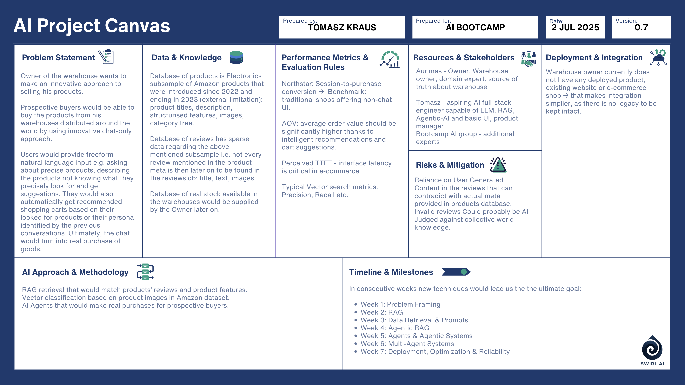

# AI Chat-Based Warehouse Assistant

## Problem Statement

The warehouse owner aims to introduce an innovative, chat-only interface to sell products. Prospective buyers can describe what they need in natural language and receive product suggestions—even without knowing exact product names. The system can generate smart shopping carts and eventually guide users through real purchases.

## Data & Knowledge

- **Products Dataset:** Electronics subsample from Amazon (2022–2023) with title, description, structured features, images, and categories.
- **Reviews Dataset:** Sparse metadata, not every review is linked directly to product meta.
- **Real Stock Data:** To be provided later by the warehouse owner.

## Performance Metrics & Evaluation

- **Northstar:** Session-to-purchase conversion (benchmark: non-chat UI).
- **AOV (Average Order Value):** Expected to increase via intelligent cart suggestions.
- **Latency (TTFT):** Perceived interface responsiveness is key.
- **Vector Search Metrics:** Precision, Recall, etc.

## Resources & Stakeholders

- **Aurimas:** Warehouse owner, domain expert.
- **Tomasz:** AI full-stack engineer & product manager.
- **Bootcamp Group:** Expert collaborators and support.

## Risks & Mitigation

- **User-Generated Content:** Potential mismatch with actual product data.
- **Invalid Reviews:** Can be filtered using AI or judged against global knowledge.

## Deployment & Integration

No legacy systems to maintain – integration is simplified due to lack of existing e-commerce platform.

## AI Approach & Methodology

- RAG retrieval combining product reviews and features.
- Vector classification from Amazon product images.
- Agentic systems to simulate real-world purchasing.

## Timeline & Milestones

In consecutive weeks, the project will evolve through:

- **Week 1:** Problem Framing  
- **Week 2:** RAG  
- **Week 3:** Data Retrieval & Prompts  
- **Week 4:** Agentic RAG  
- **Week 5:** Agents & Agentic Systems  
- **Week 6:** Multi-Agent Systems  
- **Week 7:** Deployment, Optimization & Reliability  
- **Week 8:** Capstone Project

---

**Date:** July 2, 2025  
**Version:** 0.7  
**Prepared by:** Tomasz Kraus  